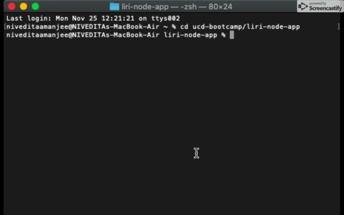

Clearly state the problem the app is trying to solve (i.e. what is it doing and why)
Give a high-level overview of how the app is organized
Give start-to-finish instructions on how to run the app
Include screenshots, gifs or videos of the app functioning
Contain a link to a deployed version of the app
Clearly list the technologies used in the app
State your role in the app development

# liri-bot-app
This app is an interactive system using Node.js. Users can retrieve information about a concert (based on an artist search), a movie, or a song, and the liri bot uses API's to get the information the user requests. The purpose of the app is to demonstrate the basic functionality of Node.js and how it interacts with different packages, such as API request package, Axios, spotify-node-api package, and moment.js package, to carry out api request functions.

## Technologies Used 
* Node.js
* Axios
* Node-Spotify-API
* OMDB API
* Bands in Town API
* Moment
* DotEnv
* File-system

## App Instructions 
Liri bot filters search requests by the user throught the use of four topic names: concert-this, movie-this, spotify-this-song, and do-what-it-says.

### concert-this 

### movie-this

### spotify-this-song

### do-what-it-says
