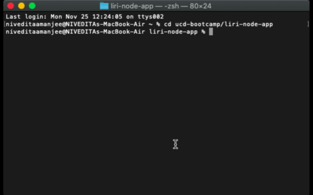

Clearly state the problem the app is trying to solve (i.e. what is it doing and why)
Give a high-level overview of how the app is organized
Give start-to-finish instructions on how to run the app
Include screenshots, gifs or videos of the app functioning
Contain a link to a deployed version of the app
Clearly list the technologies used in the app
State your role in the app development

# liri-bot-app
This app is an interactive system using Node.js. Users can retrieve information about a concert (based on an artist search), a movie, or a song, and the liri bot uses API's to get the information the user requests. The purpose of the app is to demonstrate the basic functionality of Node.js and how it interacts with different packages, such as API request package, Axios, spotify-node-api package, and moment.js package, to carry out api request functions.

## Technologies Used 
* Node.js
* Axios
* Node-Spotify-API
* OMDB API
* Bands in Town API
* Moment
* DotEnv
* File-system

## App Instructions 
Liri bot filters search requests by the user throught the use of four topic names: **concert-this, movie-this, spotify-this-song, ** and **do-what-it-says**.

### concert-this 

1. Enter "node liri-js" and the topic search "concert-this".
1. Enter the name of any artist you would like to search.
1. The Liri Bot will then return a venue, venue location, and date of the artist's concert.

### movie-this

1. Enter "node liri-js" and the topic search "movie-this".
1. If you do not enter the name of any movie, liri bot will by default return to you the information of the movie "Mr. Nobody".
1. Otherwise, you can search any movie and liri-bot will return to you the title of the movie, the movie's release date, IMDB rating, Rotten Tomatoes rating, country of production, movie language, movie plot and movie actors. 

### spotify-this-song

1. Enter "node liri-js" and the topic search "spotify-this-song".
1. Search any song and liri-bot will return to you the artists, song name, preview link of the Spotify song, and the album the song is from. 

### do-what-it-says

1. Enter "node liri-js" and the topic search "concert-this".
2. Type in the topic "do-what-it-says" and using the file system package, liri bot will read what is in the inner files which reads "spotify-this-song, 'I want it that way'", and perform those functions in the command line. Liri bot will return information about the song "I Want it That Way" by the Backstreet Boys.
